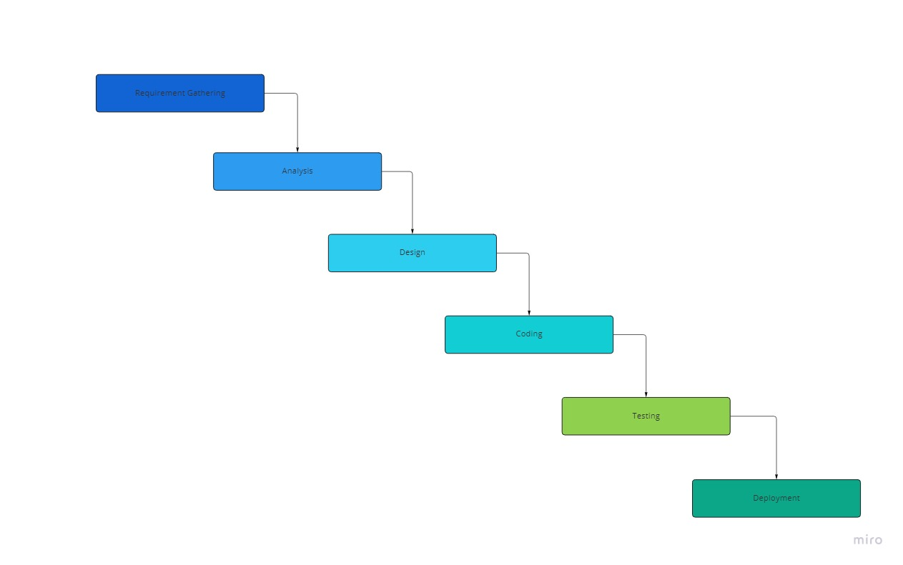

Projects at Senwes Applications follow the waterfall methodology, please read [this](https://blog.hubspot.com/marketing/waterfall-methodology){:target="_blank"} article in this regard. 
[Miro Waterfall Model](https://miro.com/app/board/uXjVPaY7IB4=/?share_link_id=444726355654){:target="_blank"}. 

Senwes Applications use [Microsoft Planner](https://tasks.office.com/senwes.co.za/en-US/Home/Planner/){:target="_blank"}, with related buckets to implement the [Kanban](https://www.knowledgetrain.co.uk/agile/agile-project-management/agile-project-management-course/kanban-principles){:target="_blank"} methodology.