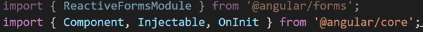

Senwes Applications use Angular as the main front end Framework.
Please keep all bundles sizes under 2MB. Please note that the more packages a project uses, the bigger in size. Weigh the pros and cons of a package against ease of use vs size and data speeds. 

### Site Standards
Always work from the original template from the site you are working with. Layouts and ideas can be used that is in the template. The site must have the same look & standard. An easy example is modals, rather use the one that the template has then to import a new one that will increase the compiled application size. Clone the project from Azure DevOps.
[Angular Startup Project](https://senwes.visualstudio.com/Applications/_git/Applications?path=/AngularStartupProject){:target="_blank"}.

Senwes Applications make use of [Syncfusion](https://ej2.syncfusion.com/angular/documentation/introduction/){:target="_blank"} keep under release version 19.? and [Nebular](https://akveo.github.io/nebular/docs/getting-started/what-is-nebular#what-is-nebular){:target="_blank"} third party components, with [Font Awesome](https://fontawesome.com/v4/){:target="_blank"} and [Eva Icons](https://akveo.github.io/eva-icons/#/){:target="_blank"}.

### General
* <b>Private variables</b> start with an underscore and lowercase then pascalCase: private bool _isVisible;
* <b>Paramenters</b> must be descriptive (<b>do not use</b>: int value) and start with lowercase then pascalCase: (int employeeNumber)
* <b>Methods</b> give descriptive names as simple as possible. Starts with lower letter then pascalCase. getEmployee(int employeeNumber)

### Basic Types
Arrays
let arr: Array<type> = [];

Iterators
For each:
A for each is different from the one in C# even though it will still work. Rather use how typescript prefers it to be used:
Array.forEach((item) => {
// do foreach
});

### Optimizing your app size

Start by removing unused imports if the Visual Studio Code is up to date it will indicate unused code by dimming it out, the example can be seen in the picture below “ReactiveFormsModule” is not being used in the component.

When it comes to the larger module you can also reduce the size by including only the module you need within the main module instead of including the main module only. See the example below: 
>> import { FilterSettingsModel, GridComponent, PageSettingsModel, ToolbarItems, ExcelQueryCellInfoEventArgs, TextWrapSettingsModel, SearchEventArgs } from '@syncfusion/ej2-angular-grids';

This will compile the entire module that can take up an unnecessary size in the application.

Rather specify the specific module you will be going to use.
>> import { FilterSettingsModel, GridComponent, PageSettingsModel } from '@syncfusion/ej2-angular-grids';

Organizing your Angular Component(typescript)
Readability will already make the next developers life so much easier that needs to work on your code.

Organize your properties by data type keeping it all together and splitting it up with a new line.

Example 
objectOne: any = []; 
objectTwo: any  = [];

isTrue: boolean;
isFalse: boolean;

clientName: string = 'John';
clientSurname: string = 'Doe';

clientAge: number;

Indicate on functions if it is public or private. Move all private functions to the button of the component keep what is private sperate from the public functions.
