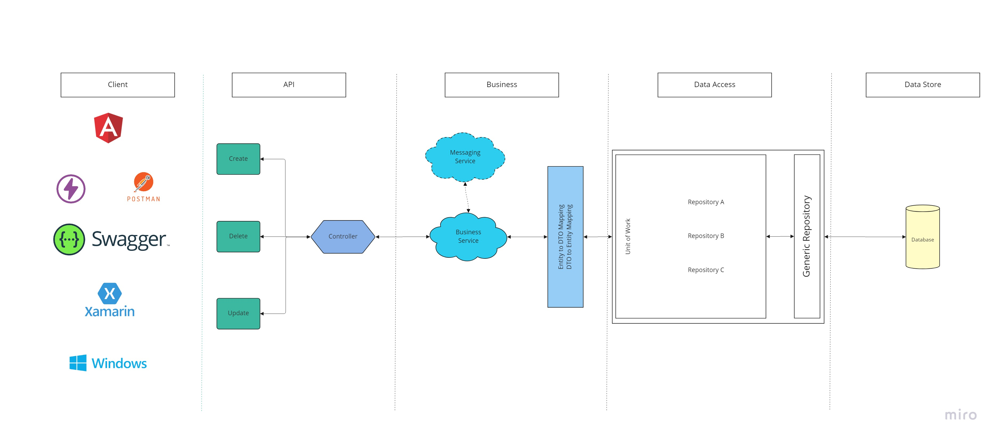

Service Example
Core Business Logic 
> HumanResources 
>> PerformanceDevelopment 
>>> Approval.cs 

### Services (Services always end with xxx.Service)
Always use a solutions folder if it does not already exist
* HumanResources (Solutions Folder)
* PerformanceDevelopment.Service

All Services are suffixed with dotService in order to make finding the actual DLL easy within a solution.

### Structure
* Layered Architecture. Click [here](https://miro.com/app/board/uXjVPaY7IB4=/?share_link_id=528900992742){:target="_blank"} to view or update this structure in Miro.

* Our policy is each service does one thing and one thing well. 
* The service business logic will not be repeated. Even though the Core project is available across services. 
* All services will return a DTO and never an entity. The entity itself is shielded from the controller. A DBcontext cannot be initialized from the Business layer. 
* Use caching in instances where common data is queried and does not change much. 
* Use relationships so that you limit DB connections. 

### Caching
* In-Memory Cache in dotNet:
1. Caching can be done using inline caching or cache action filters. Example of these can be found in the Globalntegration > Helpers > Filters Folder
* For Angular caching, read [this](https://baldur.gitbook.io/angular/rxjs/rxjs/sharereplay){:target="_blank"} related article on ShareReplay.
* Please take precaution when using caching. Refresh/Delete the cache when data changes etc.

### Service Solutions contains the following projects
* PerformanceDevelopment.Service.API
> Controllers
* PerformanceDevelopment.Service.Business
> Business Logic related only to this project
* PerformanceDevelopment.Service.Data
> DbContext
> Model Enitities
> Unit of Work
* PerformanceDevelopment.Service.Dto
> Classes correcponding to enities in Model Enitities
* PerformanceDevelopment.Service.Integration
> All calls to external Services (Preferred method: fluently)
* PerformanceDevelopment.Service.UnitTests
> Create unit tests per model entity 

### DTO
Example: ApprovalDTO
* We try to keep dtos named in the same way as the Entity they represent. 
* Dto’s are placed in the same folder structure as mentioned above. 
* HumanResources > PerformanceDevelopment.Service.Dto > ApprovalDTO.cs

### Naming Conventions for Controllers and Actions (Web API)
* Use plural nouns for Controllers
* Use nouns but no verbs for Actions
* If a method status it only gets an employee, it should only do that.
* HumanResources > PerformanceDevelopment.API > ApprovalController.cs

### General
* Always prefer meaningful names for your class, property, method, etc. This will be very useful for you to maintain the code in future.
* Never have a different class or variable name that is in a different case. Example Person and person.
* Don't use the same name used in .NET Framework. People who are new to your code have great difficulty to understand it easily.
* Always use “I” as prefix for Interfaces. This is a common practice for declaring interfaces.
* Never prefix or suffix the class name to its property names. It will unnecessarily increase the property name. If “Firstname” is a property of “Person” class, you can easily identify it from that class directly. No need to write “PersonFirstname” or “FirstnameOfPerson”.
* The prefix “Is”, “Has” or “Can” for boolean properties like “IsVisible”, “HasChildren”, “CanExecute”. These give proper meaning to the properties.
* <b>Private variables</b> start with an underscore: private bool _IsVisible;
* <b>Paramenters</b> must be descriptive (<b>do not use</b>: int value) and start with lowercase then pascalCase: (int employeeNumber)
* <b>Methods</b> give descriptive names as simple as possible. Starts with capital letter, then pascalCase. GetEmployee(int employeeNumber)
* When a method has a return value that will not be used, use discards, this enhance its readability and maintainability. [Discards - C# Fundamentals](https://docs.microsoft.com/en-us/dotnet/csharp/fundamentals/functional/discards){:target="_blank"}
* Always use curley brackets {} for if, switch, for, etc statements, even if it has only one line of code.
